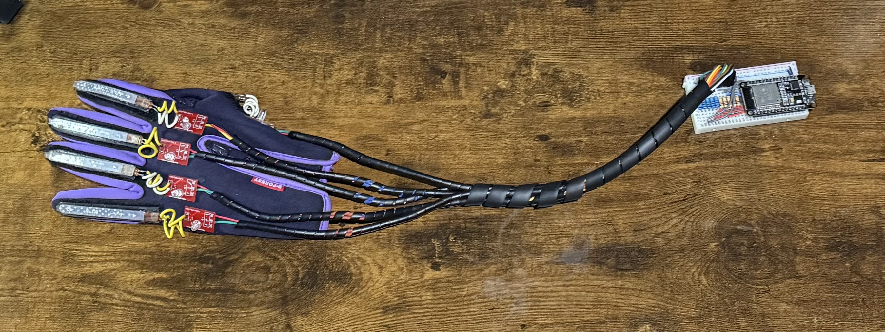
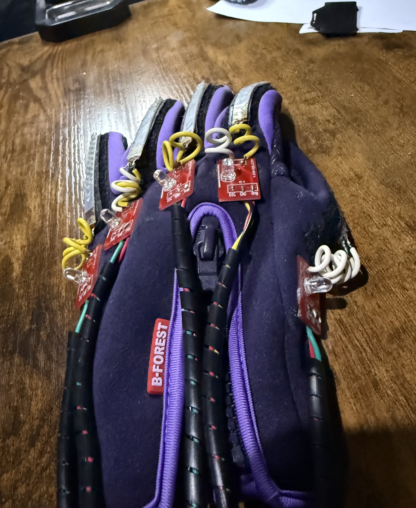
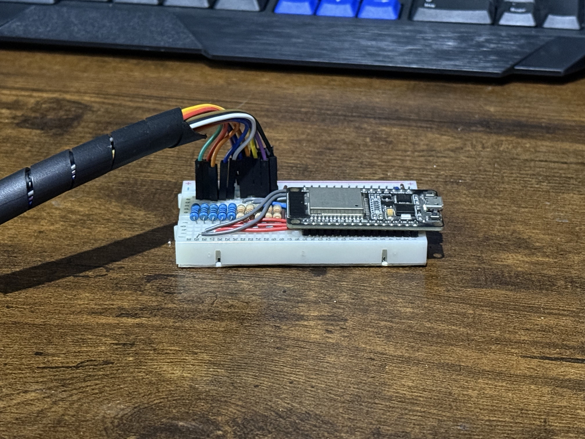
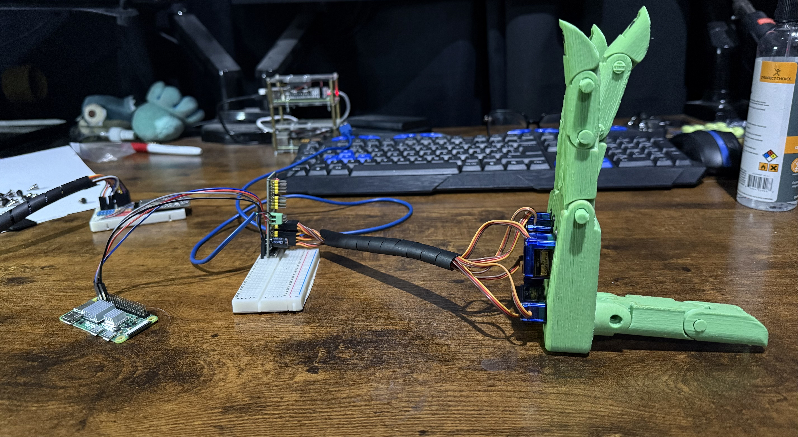
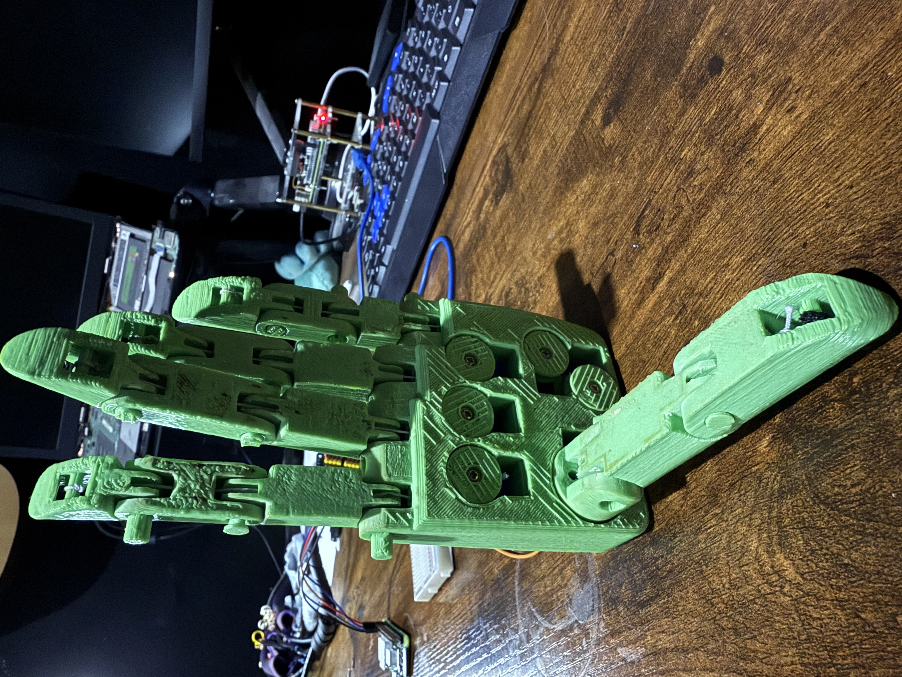

# remote_hand
This project features a 3D-printed robotic hand that is remotely controlled using a glove equipped with flex sensors. The system is divided into two main parts: **client** and **server**, which communicate using **UDP sockets**.

## System Overview

- **Sensor Glove (Client):** An ESP32 reads finger flexion using flex sensors. Each sensor reading is mapped to an angle, then sent via UDP to the server.

- **Robotic Hand (Server):** A Raspberry Pi Zero 2W receives the angle data and controls servo motors connected via a **PCA9685 module**, flexing the 3D-printed fingers accordingly.

##  Technologies & Hardware

- **MicroPython** (used throughout the project)
- **ESP32** (client for reading sensors)
- **Raspberry Pi Zero 2W** (server for controlling servos)
- **PCA9685** (for precise servo control)
- **UDP Sockets** (communication protocol)
- **Flex Sensors**
- **Servo Motors**
- **3D Printing** (structure of the robotic hand)

## Project Structure
```
remote_hand
    ├───common
    │       misc.py
    │       wifi_driver.py
    │       __init__.py
    │
    ├───reciever
    │       finger_servo.py
    │       hand_servo.py
    │       main.py
    │       server.py
    │       servo.py
    │       __init__.py
    │
    └───sender
            client.py
            finger_sensor.py
            hand_sensor.py
            main.py
            __init__.py
```

### common dir
This directory contain common files for the sender and reciever. 
- **misc.py** Contain macros for both modules, common data structures, etc.
- **wifi_driver.py** Is the common class for connecting a micropython device to the network.

### reciever dir
This directory contain all nececesary files to bring up a server instance. 
- **finger_servo.py** Servo finger class
- **hand_servo.py** Servo hand class
- **server.py** Class for setting up the server, process messages and control robot hand
- **servo.py** Class for using servo motor
- **main.py** main file

### sender dir
This directory contain common files for the sender and reciever. 
- **finger_sensor.py** Finger sensor class
- **hand_sensor.py** Sensor hand class
- **client.py** Class for setting up the client, read whole hand data and send it to server.
- **main.py** main client file

## Images
The client (sender) is made of a glove with the sensors attached as shwon below







And the reciever is the printed 3D hand with servos





## Connection diagrams

Todo

## Installation

### Client (ESP32)
At this point you supposed to have a glove with the flex sensor and led finger sensors. You can follow the connection schema for hand sensor provided below

1. Flash MicroPython on your ESP32.
2. Upload  `common/misc.py`, `sender/main.py`,  `sender/client.py`,  `sender/finger_sensor.py`,  `sender/hand_sensor.py` to the board.
3. Connect the flex sensors to the correct GPIO pins following diagram above (you can modify the GPIO pins via FINGERS_BUILD_DATA).
4. Restart when server is up

### Server (Raspberry Pi)
At this point you supposed to have a remote robotic hand with 6 servos. You could follow the connection schema for robotic hand provided below

1. From a console whitin the Zero 2W (with raspberry OS) run `cd ~; git clone CaraDetruza/remote_hand`
2. `cd remote_hand/reciever`
3. Run `main.py`.

## Communication Protocol

- **Protocol:** UDP
- The client sends a data packet containing the mapped angle values for each finger.
- Data payload is 5 bytes length and each byte can have values from 0 to 180, corresponding to the current angle in degrees.
```
Payload
byte 0 - double pourpose, if byte is 255, thats a handshake message, otherwise value corresponds to first finger angle
bytes 1 to 4 - fingers angles
```
The finger indexes are declared in `common/misc.py`.
- The server receives the data unpack it and move the servo with the corresponding angle.
- If message is handshake, server send handshake back to the client.

## License

Idk feel free to use, modify, and share it :P
